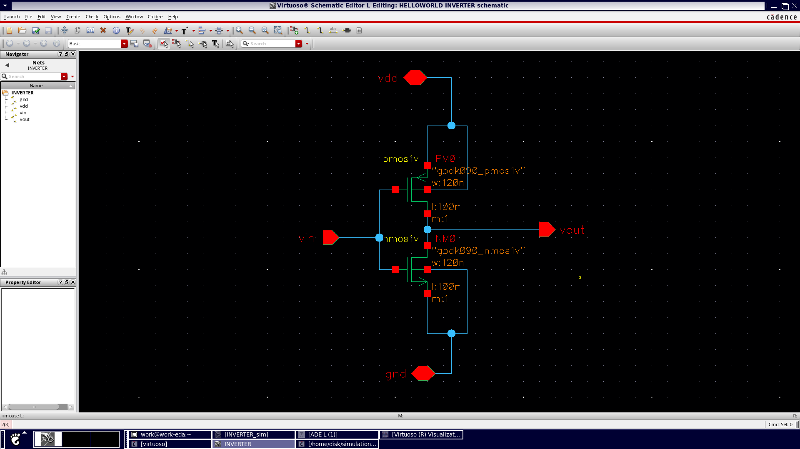

# Project Title: CMOS Inverter in 90nm Technology

## Table of Contents
1. [Introduction](#introduction)
2. [Why CMOS Inverter?](#why-cmos-inverter)
3. [CMOS Inverter Analysis (Pre-Layout)](#cmos-inverter-analysis-prelayout)
    1. [DC Analysis](#dc-analysis)
    2. [Transient Analysis](#transient-analysis)
    3. [DC Parametric Analysis](#dc-parametric-analysis)
4. [Layout](#layout)

## Introduction
This project was created after my second year of study. It involves designing a CMOS inverter in 90nm technology using Cadence, along with DC analysis and layout.

## Why CMOS Inverter?
Why CMOS Inverter?
While NMOS alone might be simpler, it leads to higher power consumption, poor noise immunity, and limited functionality. CMOS, combining both PMOS and NMOS, is more efficient, reliable, and scalable for modern digital circuits.
### Construction
A CMOS inverter is made up of two transistors:
-A PMOS transistor connected to Vdd (positive supply voltage)
-An NMOS transistor connected to Vss or GND (ground)
Both transistors share the same input voltage (Vin) at their gates, and the output (Vout) is taken from the connection point between the PMOS and NMOS.

Transistor as a Switch
- Off State: The transistor exhibits infinite resistance when Vgs < Vt.
- On State: The transistor has finite resistance when Vgs > Vt.

Working of CMOS Inverter
When Vin is High (Vin = Vdd):
- PMOS transistor: Turns OFF.
- NMOS transistor: Turns ON.

When Vin is Low (Vin = 0V):
- PMOS transistor: Turns ON.
- NMOS transistor: Turns OFF.

Current Flow in CMOS Inverter
When Vin = Vdd (High Input):
- A direct path exists between Vout and Vss.
- As a result, Vout = 0V (Logic Low).

When Vin = 0V (Low Input):
- A direct path exists between Vdd and Vout.
- As a result, Vout = Vdd (Logic High).

## CMOS Inverter Analysis (Pre-Layout)

**##schematic**

### DC Analysis
DC analysis would be used to plot a Voltage Transfer Characteristics (VTC) curve for the circuit. It will sweep the value of Vin from high to low to determine the working of circuit with respect to different voltage levels in the input. The following plot is observed when simulated :

### Transient Analysis
This section covers the transient analysis, including the inverter's response to input changes over time.

### DC Parametric Analysis
This section explains the parametric DC analysis, where you evaluate different design parameters under various conditions.

## Layout
In this section, you will discuss the layout of the CMOS inverter, including the tools used, layout design considerations, and any other relevant details.
