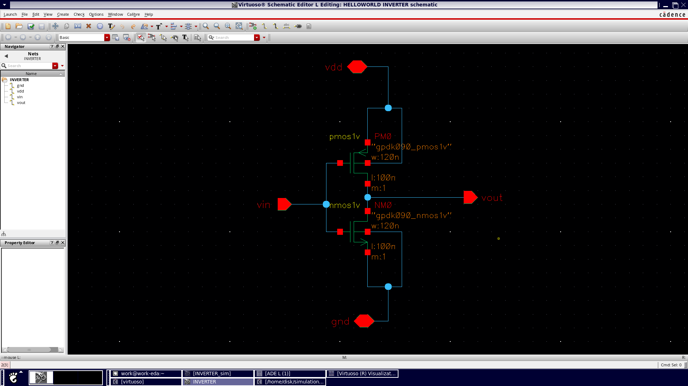
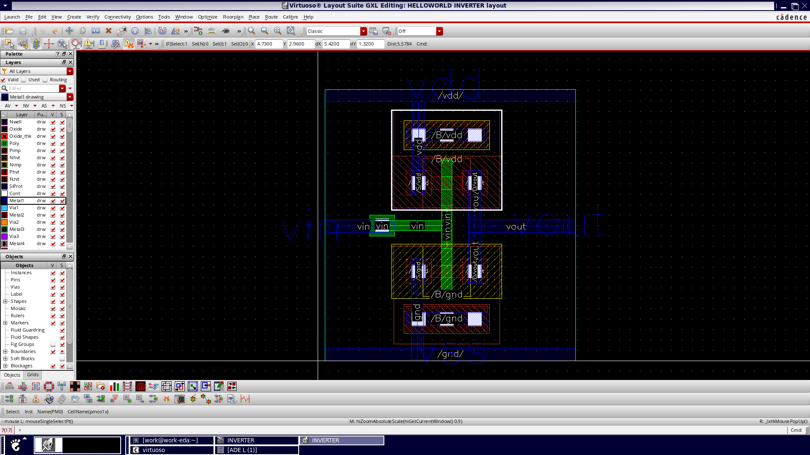

# CMOS Inverter Project – Image Reference and Workflow

This folder contains key images documenting the process of designing, simulating, analyzing, and laying out a CMOS inverter. Below is a step-by-step overview of the workflow, along with associated image references and brief descriptions.

---

## 🛠️ Workflow Overview

### Step 1: Design the Schematic  
Start with creating a transistor-level schematic of the CMOS inverter using PMOS and NMOS transistors.

  
*CMOS inverter schematic showing the fundamental structure of the inverter.*

---

### Step 2: Use the Inverter Symbol in Larger Circuits  
Once the schematic is verified, the inverter can be used as a symbol in larger digital circuits.

  
*Simplified symbol of the CMOS inverter used in block-level or hierarchical designs.*

---

### Step 3: Run Simulations  
Simulate the inverter to analyze its performance in terms of output behavior, switching threshold, and voltage levels.

  
*Transient analysis showing input-output waveforms, confirming logic inversion and transition behavior.*

---

### Step 4: Analyze Voltage Transfer Characteristics (VTC)  
Identify key parameters such as VOL, VOH, VIL, VIH, and VTH from the VTC curve.

  
*VTC plot annotated with logic voltage levels and switching threshold.*

---

### Step 5: Measure Propagation Delay  
Determine timing performance by measuring TPLH (low-to-high) and TPHL (high-to-low) delays.

  
*Waveform markers used to calculate the propagation delay of the inverter.*

---

### Step 6: Evaluate Noise Margins  
Ensure the inverter can tolerate noise in the input without affecting output logic.

  
*Graphical representation of noise margins derived from the VTC.*

---

### Step 7: Create Physical Layout  
Design the physical layout of the CMOS inverter using layout tools. This layout represents how the circuit would be fabricated.

  
*Unlabeled layout view showing transistor placements and interconnections.*

---

### Step 8: Annotate the Layout  
Label the different parts of the layout for easier verification and design rule checks.

  
*Final labeled layout, indicating NMOS/PMOS regions, contacts, and metal layers.*

---

## 🧠 Summary

This folder documents the **complete CMOS inverter design flow** from schematic to layout and performance analysis. It can be used for reports, presentations, or future reference in digital logic design or VLSI courses.

